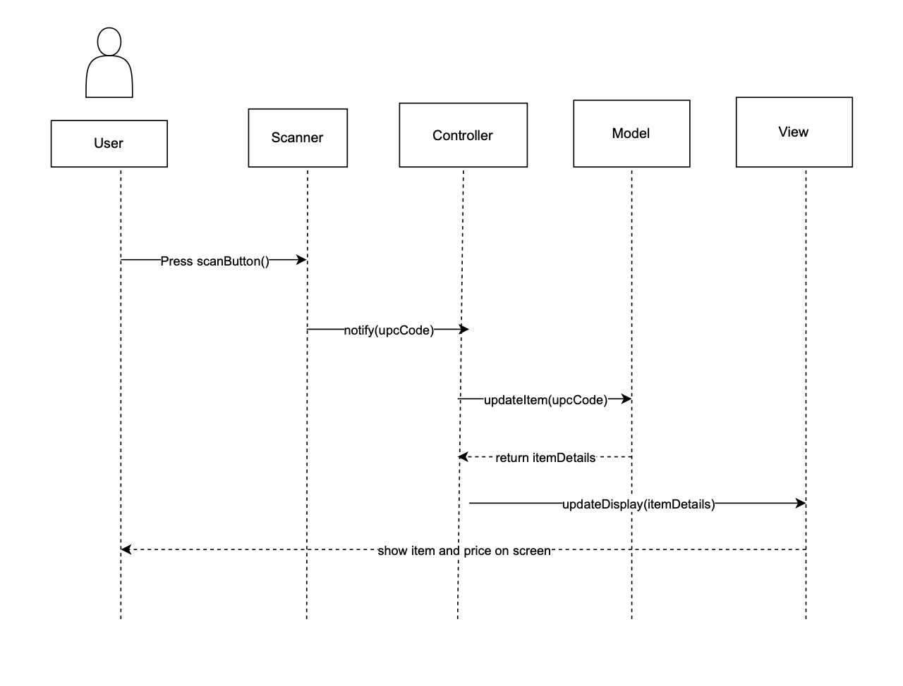
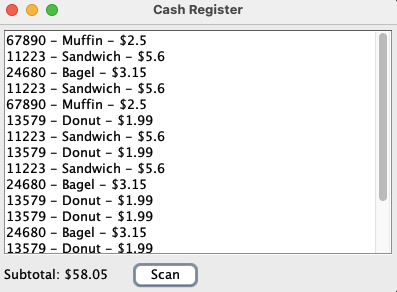

## Responsibility Overview
| Task | Name |
|:-----|:-----|
| Question 1    |  Shayaan Kashif   |
| Question 2     |     Shayaan Kashif |
| Coding     | Shayaan Kashif     |
| Sequence Diagram     | Kenneth Droid      |
| High level Class Diagram    | Mohit Gajula    |
------


## File Structure
```bash
assignment2-swing-mvc-group-10-crn-43510/
├── README.md                                    # Project documentation
├── Sequence Diagram.png                         # Sequence diagram documentation
├── Output.png                                   # Shows expected output of the application
├── High Level Diagram.png                       # High Level Class Diagram
└── SwingMVC/                                    # Main application directory
    ├── src/                                    
    │   ├── Main.java                           # Main File
    │   ├── Model.java                          # MVC Model - data management
    │   ├── View.java                           # MVC View - user interface
    │   ├── Controller.java                     # MVC Controller - event handling
    │   ├── Product.java                        
    │   └── products.txt                        # Sample product data
    │
    └── bin/                                    # Compiled class files
        ├── Main.class                          # Complied Main file to Run  
        ├── Model.class
        ├── View.class
        ├── Controller.class
        ├── Product.class
        ├── Controller$ScanListener.class
        └── products.txt

```

## How to Run
In you terminal navigate to the SwintgMVC folder:
```bash
cd SwingMVC
```
Once in the folder the next navigate to the bin folder: 
```bash
cd bin
```
Lastly run the following command:
```bash
java Main
```
```bash
NOTE: The src/ folder contians the actual code where as the bin/ folder contians the complied code which is to be run.
```

------
### Question 1
Java Swing framework is part of the Java foundation classes and can be used to create various different applications. However it is primarily used to create graphical user interfaces (GUI) for desktop applications. The components of Java swing are lightweight compared to the Abstract Window Toolkit (AWT) which are heavy weight. Essentially AWT relied on the Operating systems controls whereas Swing draws everything in Java which gives it a faster runtime. 

## High Level Class Diagram


----

### Question 2
 The code given in the Github repo follows the MVC pattern as shown in the lectures as the Model.java file is used to store the firstname and lastname and provides getters and setters in order to update the data. From the lectures we know that the Model should act as the data layer storing the information which can be seen here. The View.java defines the GUI with labels and textfields which also matches what is described in the lectures as it is responsible for showing the user information and allowing them to interact with the application. Furthermore the Controller.java acts as the link layer between the view and the model as it attaches event listeners and handles the users interactions. All of these components follow the MVC pattern described in the lectures as all of their responsibilities match what was shown. However there are some differences. In the conventional MVC the Model notifies the View and Controller of changes using the Observer pattern. However in the repo the controller directly updates both the model and the view and the model does not send any notifications to the view. Additionally in the conventional MVC the controller does not have any UI logic however in the assignment the controller does contain UI logic code and other display functions. 

## Sequence Diagram


## Output

